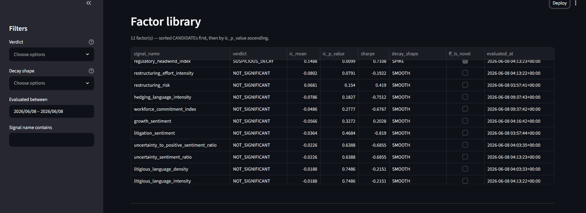
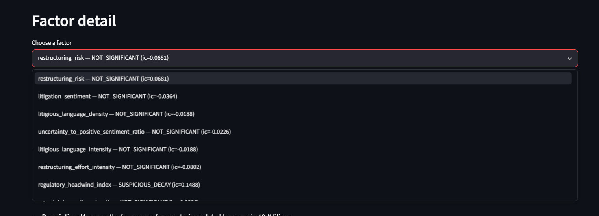
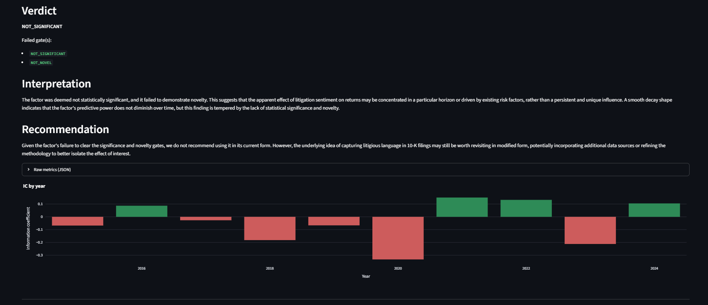

# Quant Factor Research Engine

**An autonomous LLM-orchestrated pipeline that discovers, backtests, and rigorously validates quantitative equity factors from SEC filings — built for IB Quant Research / Quantitative Data Science roles.**

---

## Table of contents

1. [Why this project](#why-this-project)
2. [Architecture](#architecture)
3. [Dashboard](#dashboard)
4. [Methodology highlights](#methodology-highlights)
5. [Limitations (honest)](#limitations-honest)
6. [Results so far](#results-so-far)
7. [Tech stack](#tech-stack)
8. [How to run](#how-to-run)
9. [Project structure](#project-structure)
10. [Roadmap / future work](#roadmap--future-work)

---

## Why this project

Quant research is normally a slow, manual loop: an analyst reads filings, brainstorms a hypothesis ("does hedging language predict returns?"), hand-codes a signal, backtests it, checks whether the result is statistically real or a fluke, and writes it up — then repeats, often rediscovering ideas already tried and rejected. This project automates that entire loop end to end: an LLM proposes structured, machine-executable factor hypotheses grounded in measured data statistics; a deterministic engine computes the signal, backtests it, and runs it through three independent statistical gates (significance, decay-shape sanity, and orthogonality to known factors); a second LLM writes the memo using only numbers the engine produced; and the system remembers what it has already tried so it doesn't repeat itself. What's novel here isn't "use an LLM to find factors" — it's wrapping that LLM in a validation harness rigorous enough that *most of its ideas should fail*, and being honest when they do.

## Architecture

The research cycle is a single linear [LangGraph](https://github.com/langchain-ai/langgraph) `StateGraph` (`orchestration/research_graph.py`), with one conditional retry edge:

```
        ┌────────────────────────────────────────────────────────────┐
        │                                                              │
        ▼                                                              │
 ┌────────────┐   ┌────────────┐   ┌─────────┐   ┌────────────┐   ┌────────┐   ┌─────────┐   ┌─────────┐
 │  feedback  │ → │  generate  │ → │  dedup  │ → │  evaluate  │ → │ report │ → │ persist │ → │ summary │ → END
 └────────────┘   └────────────┘   └─────────┘   └────────────┘   └────────┘   └─────────┘   └─────────┘
                        ▲               │
                        │   (retry,     │
                        └─ capped at 1) ┘
                     if < 2 hypotheses survive dedup
```

| Node | What it does | Module it calls |
|---|---|---|
| `feedback` | Reads the factor library index, picks up to 5 past CANDIDATEs (by `\|ic_mean\|`) and up to 10 recent rejections, and loads their full descriptions/rationales as "prior results" context. | `factor_library.store.load_index` / `load_record` |
| `generate` | **(LLM — Signal Finder)** Proposes new `FactorHypothesis` objects, grounded in measured cross-filing statistics and steered by the prior-results context (toward themes that worked, away from ones that didn't). | `agents.signal_finder.generate_hypotheses` |
| `dedup` | Embeds each new hypothesis's *meaning* and checks cosine similarity against everything already proposed; drops near-duplicates. If fewer than 2 survive, triggers exactly one retry of `generate` with a stronger "be substantially different" instruction. | `agents.dedup_store.is_duplicate` / `add_hypothesis` |
| `evaluate` | Runs the full deterministic backtest + three-gate validation suite and produces a PASS/FAIL verdict per surviving hypothesis. | `backtest.evaluate_factor.evaluate_factor` |
| `report` | **(LLM — Report Writer)** Writes the narrative prose (Summary / Interpretation / Recommendation) for each verdict; the numeric sections are assembled by code, never by the model. | `agents.report_writer.write_memo` |
| `persist` | Saves the verdict, full record, and memo to the factor library, and stores the hypothesis in the dedup store for future runs. | `factor_library.store.save_factor`, `agents.dedup_store.add_hypothesis` |
| `summary` | Prints a run summary: hypotheses generated → survived dedup → evaluated → CANDIDATEs → factors saved. | (in-graph) |

**The LLM touches exactly two nodes** — `generate` (Signal Finder, `agents/signal_finder.py`) and `report` (Report Writer, `agents/report_writer.py`) — both via Groq / `langchain-groq`. Every other node, including the entire backtest and validation suite, is deterministic Python with no model calls. Per-hypothesis failures are caught and logged so one bad proposal can't crash a run; when a node drops an item it drops it from every parallel list (`hypotheses` / `evaluated` / `memos`) so downstream nodes stay aligned by index.

## Dashboard


*Factor library browser with verdict and decay filters*


*Per-factor research memo (numbers from engine, narrative from LLM)*


*Yearly Information Coefficient breakdown*

## Methodology highlights

- **Point-in-time discipline.** All forward returns are anchored on `filing_date` — the date a document actually became public on EDGAR — never `report_date` (the fiscal period it *covers*, which is knowable only in hindsight). Prices snap forward to the next trading day so weekend/holiday filings can never borrow a pre-announcement price. See `backtest/point_in_time.py` for the formal lookahead-avoidance guarantee (`price_date >= t0_entry_date >= filing_date`).

- **Eligibility rule.** At each ranking date a stock is included only if it has **≥ 252 trading days** of prior price history *and* a filing **no older than 12 months** (measured from `filing_date`, not `report_date`, again to prevent lookahead). Factors are scored only over eligible names.

- **Three-gate validation** (`backtest/evaluate_factor.py`) — a hypothesis only earns the `CANDIDATE` verdict if it clears *all three*:
  1. **IC significance** (`validation/ic_significance.py`) — one-sample t-test on the per-period Spearman IC series, `p < 0.05`.
  2. **Factor decay shape** (`validation/factor_decay.py`) — IC measured at 5d / 21d / 63d horizons must show a credible shape (`MONOTONIC_DECAY`, `MONOTONIC_BUILD`, or `SMOOTH`); an isolated `SPIKE` at one horizon is flagged as suspicious (likely overfitting or a data artefact) and fails the gate.
  3. **Fama-French orthogonalization** (`validation/fama_french.py`) — regresses the factor's long-short return on Mkt-RF, SMB, HML, and Momentum (Ken French daily data, downloaded and cached locally); the alpha must be statistically significant (`p < 0.05`) for the factor to count as genuinely novel rather than a repackaging of known exposures.

  Anything that fails is labelled by its first-failing gate, with the *complete* set of failed gates recorded in `failed_gates` — so a researcher sees the whole picture, not just the first red flag.

- **The backtest engine is validated three independent ways**, not just trusted (`backtest/validate_momentum.py`, `backtest/ic_engine.py`):
  - A **random-noise** signal produces IC ≈ 0, as it should.
  - A **cheating signal** (constructed to leak the answer) produces IC = 1.0, confirming the sign convention and join logic are correct end to end — and its decay curve correctly peaks at the shortest (21-day) horizon, which the decay-shape gate correctly flags as a `SPIKE`.
  - The well-documented **12-1 momentum factor** (Jegadeesh & Titman, 1993) reproduces its known weak large-cap behaviour, with its negative result concentrated in the 2020 crash window — a textbook "momentum crash," not an engine bug. (`validate_momentum.py` explicitly re-runs the backtest excluding Feb–Dec 2020 to demonstrate this.)

- **Loughran-McDonald finance-domain sentiment.** Generic sentiment dictionaries misclassify finance terms ("liability," "tax," "cost" register as negative in general-purpose lexicons despite being neutral in a 10-K). The LM Master Dictionary (`agents/lm_dictionary.csv`, cached to `agents/lm_words.parquet`) supplies finance-specific Negative / Positive / Uncertainty / Litigious word categories that the Signal Finder can reference directly.

- **Filing-token preprocessing cache** (`agents/preprocess_filings.py` → `agents/filing_tokens.parquet`). Tokenizing all 1,435 filings on every run was the dominant cost of signal computation (~20 minutes). The cache stores per-filing word-frequency dicts for O(1) single-word/LM-category lookups; multi-word phrases (e.g. "supply chain") fall back to a raw-text scan via `data.store.load_filing_text` — slower, but correct, and rare enough that the per-hypothesis cost stays acceptable. (Bigram frequencies are deliberately *not* kept in memory at full-corpus scale — materializing them exhausted available RAM; see `agents/signal_computation.load_filing_tokens`.)

- **ChromaDB local-embedding deduplication** (`agents/dedup_store.py`). The Signal Finder LLM will happily propose the same idea worded a dozen ways ("supply chain disruption density" vs. "frequency of logistics-disruption language"). Each hypothesis's *meaning* (description + rationale + computation spec) is embedded with Chroma's local sentence-transformer (no external API) and checked against everything already stored via cosine similarity. The 0.72 threshold was empirically derived: genuine reworded duplicates score ≈ 0.76, genuinely distinct ideas score ≈ 0.49 — 0.72 sits safely between the two.

- **Numbers come from the engine, never the LLM.** The Report Writer (`agents/report_writer.py`) builds the "Hypothesis & Rationale," "Metrics," and "Verdict" sections of every memo directly from the verdict dict with f-strings — the LLM is asked only for the surrounding narrative prose (Summary, Interpretation, Recommendation), and the final memo is assembled by code splicing that prose between the code-built sections. A hallucinated statistic is structurally impossible.

## Limitations (honest)

- **Survivorship bias.** The universe is sampled from the *current* S&P 500 constituent list and applied retroactively across 2015–2024. Companies that left the index during this period (delisting, acquisition, removal) are excluded, biasing results upward by omitting underperformers. A full correction requires point-in-time index-membership data, which is out of scope here. **Reported factor performance should be read as an upper bound, not a tradeable estimate.**
- **No point-in-time index membership.** Related to the above — the engine has no way to know which stocks were *actually* in the S&P 500 on any given historical date, only which are in it today.
- **Small universe.** ~150 large-cap S&P 500 names — large enough to be statistically interesting, far too small (and too concentrated in mega-caps) to generalize to the broader market or to small/mid-cap factor behaviour.
- **Small effective sample.** With quarterly rebalancing over 2015–2024, the IC significance test runs on roughly 22–40 periods per factor — enough to catch a strong, consistent edge, but limited statistical power against a moderate one. Marginal results should be treated as inconclusive rather than negative.
- **Open-source LLM via Groq.** `llama-3.3-70b-versatile` (Signal Finder) and `llama-3.1-8b-instant` (Report Writer) are fast and free to run at scale, but meaningfully weaker than frontier models at strict structured-output tasks — hence the schema-validation retry loop in `agents/signal_finder.py` and the code-only-numbers constraint in the Report Writer, both of which exist specifically to compensate for that gap.
- **EDGAR/Yahoo resolution gaps.** Of the 150 universe tickers, a handful (e.g. `SNDK`, `PSKY`, `GEV`) failed to resolve due to recent ticker changes or spinoffs and were excluded; others are recent IPOs/spinoffs with partial history, handled by the ≥ 252-day eligibility rule rather than silently included with thin data.

## Results so far

The factor library currently contains **12 evaluated factors, 0 of which survive all three validation gates** (`factor_library/factors_index.parquet`):

| Verdict | Count |
|---|---|
| `NOT_SIGNIFICANT` | 11 |
| `SUSPICIOUS_DECAY` | 1 |
| `CANDIDATE` | 0 |

This is the expected, *correct* outcome — not a failure of the system. Most plausible-sounding factor ideas don't survive honest validation; that's precisely why the validation gates exist. A pipeline that returned a high CANDIDATE rate would be more likely evidence of a leaky backtest than of genuine alpha. The system's job is to cheaply and honestly separate the rare survivor from the much larger pile of ideas that sound reasonable but don't hold up — and, via the feedback loop, to learn from each rejection so future proposals trend away from the patterns that keep failing (litigation/restructuring/regulatory-language signals, several variants of which have now been tried and rejected).

## Tech stack

**Data layer**
- `pandas` / `pyarrow` — tabular storage and computation; all caches are Parquet
- `requests` — SEC EDGAR REST API access, Ken French data downloads
- `yfinance` — daily adjusted-close price history
- `sec-edgar-downloader` / SEC EDGAR REST endpoints — 10-K filing retrieval

**Backtesting & statistics**
- `numpy` / `scipy` — vectorized numerics, Spearman correlation, t-tests
- `statsmodels` — Fama-French / Carhart 4-factor OLS regression for alpha testing

**LLM agents & orchestration**
- `langgraph` — the linear research-cycle state graph with conditional retry
- `langchain` / `langchain-groq` — LLM client plumbing (Groq-hosted Llama models)
- `pydantic` — `FactorHypothesis` schema: the structured contract between the LLM and the deterministic computation layer
- `tenacity` — retry/backoff for LLM calls and schema-validation self-correction

**Deduplication**
- `chromadb` — persistent local vector store with built-in sentence-transformer embeddings (no external embedding API)

**Presentation**
- `streamlit` / `plotly` — read-only dashboard over the factor library and dedup store

**Config**
- `python-dotenv` — environment-based secrets/config (`GROQ_API_KEY`, `SEC_EDGAR_USER_AGENT`, model names)

## How to run

Tested on Windows with PowerShell; every step below uses cross-platform tooling (`venv`, `pip`, plain Python scripts) so it should run unmodified on macOS/Linux too.

**1. Set up a virtual environment and install dependencies**

```powershell
python -m venv venv
venv\Scripts\activate          # Windows — use `source venv/bin/activate` on macOS/Linux
pip install -r requirements.txt
```

**2. Configure secrets**

```powershell
copy .env.example .env
# then edit .env and fill in:
#   GROQ_API_KEY=<your Groq API key>
#   SEC_EDGAR_USER_AGENT=Your Name your@email.com   (SEC requires a real contact string)
#   GROQ_MODEL_SIGNAL=llama-3.3-70b-versatile       (optional override)
#   GROQ_MODEL_REPORT=llama-3.1-8b-instant          (optional override)
```

**3. Download the Loughran-McDonald sentiment dictionary**

Download the LM Master Dictionary CSV from the [University of Notre Dame SRAF page](https://sraf.nd.edu/loughranmcdonald-master-dictionary/) and save it as `agents/lm_dictionary.csv`. (`agents/signal_computation.py` builds and caches the parsed word lists to `agents/lm_words.parquet` on first use.)

**4. Pull the data** (prices + filings for the ~150-ticker universe — safe to re-run, skips already-cached data)

```powershell
python data/run_full_pull.py
```

**5. Build the filing-token cache** (tokenizes every filing once; the dominant one-time cost, ~20 minutes over 1,435 filings)

```powershell
python agents/preprocess_filings.py
```

**6. Run one research cycle** (generates hypotheses, backtests, validates, writes memos, persists results)

```powershell
python orchestration/research_graph.py
```

**7. Launch the dashboard**

```powershell
streamlit run dashboard/app.py
```

## Project structure

```
agents/            Signal Finder & Report Writer (LLM agents), hypothesis schema,
                   signal computation, LM dictionary, dedup store, preprocessing
backtest/          IC engine, portfolio/quantile backtest engine, point-in-time
                   join logic, momentum-validation suite, factor evaluation pipeline
validation/        IC significance testing, factor decay-shape analysis,
                   Fama-French orthogonalization
orchestration/     LangGraph research-cycle wiring (the end-to-end pipeline)
factor_library/    Persistence layer — evaluated-factor index, JSON records, memos
config/            Universe construction (~150 S&P 500 tickers), settings/secrets
data/              EDGAR downloader, price loader, filing/price storage helpers
dashboard/         Read-only Streamlit app — browse the factor library and dedup store
tests/             Test scaffolding
```

## Roadmap / future work

- **Bigger, more representative universe** — extend beyond ~150 large-caps toward broader market-cap and sector coverage to improve generalizability and statistical power.
- **Point-in-time index membership** — replace the current-constituents snapshot with a historical membership feed to remove survivorship bias rather than merely disclosing it.
- **Sector-conditional factors** — let the Signal Finder propose, and the evaluator test, factors whose efficacy is conditioned on GICS sector rather than assuming one universal relationship across the whole universe.
- **Alternative embedding models for dedup** — benchmark Chroma's default local embedder against larger open-source sentence-transformer models to see whether the 0.72 similarity threshold (and the false-positive/negative balance around it) holds up or needs re-tuning.
- **Walk-forward retraining of the feedback loop** — `feedback_node` currently looks back over the *entire* factor-library history each cycle; a walk-forward variant would let the system's "what's been tried" memory evolve in lockstep with an expanding-window backtest, closer to how a live research desk actually operates.
